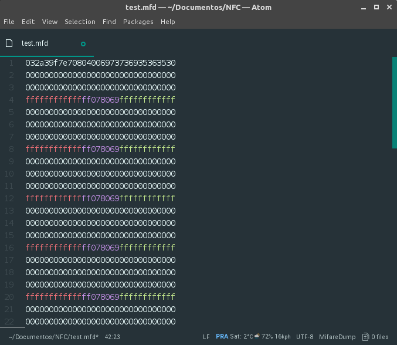

# atom-mifare

Syntax highlighting for Mifare MFD dumps.

Inspired on [mfdread](https://github.com/zhovner/mfdread)

### Installation

~~~bash
apm install atom-mifare
~~~

Or from source:

~~~bash
git clone https://github.com/joanbono/atom-mifare
mv atom-mifare $HOME/.atom/packages
~~~

#### Screenshot

